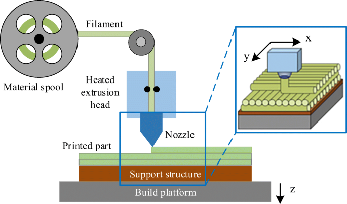

# Impresora 3D

Una impresora 3D es una máquina que permite imprimir objetos tridimensionales a partir de un modelo digital. 
Para ello, la impresora 3D recorre la superficie del objeto capa por capa, de abajo hacia arriba, hasta cubrir el modelo.

En este proyecto simularemos una impresora 3D que imprime un objeto bidimensional a partir de un archivo *svg*.

# Descripción
* Cargue los archivos *svg* de la carpeta `models`.
* Cree una interfaz de usuario para configurar parámetros de impresión. 
    * Resolución de impresión (distancia entre puntos de deposición).
    * Velocidad
* Encuentre la trayectoria que debe recorrer la impresora 3D para los parámetros establecidos.
* Dibuje la trayectoria en la pantalla.

# Ejemplo
Video con la descripción para resolución de impresión de 0.1 y 0.5.
<video controls loop autoplay src="assets/printer3d.mp4" title="Title"></video>

# Casos de prueba
* Existe 4 archivos *svg* de ejemplo en la carpeta `models`.
* Existe además, 2 archivos de prueba que serán evaluados el día de la presentación de proyectos. 

# Preguntas de análisis
* ¿Qué área del objeto es cubierta por la impresora 3D con su algoritmo?
* ¿Cómo se ve afectada la impresión si se cambia la resolución?
* ¿En qué casos la estrategia diseñada no tiene un buen rendimiento?