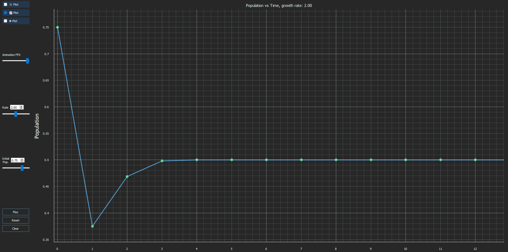
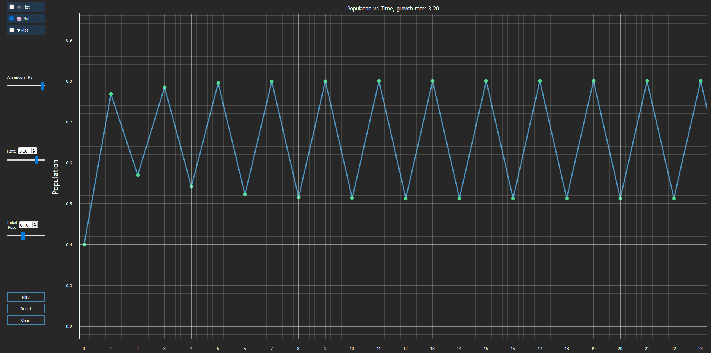
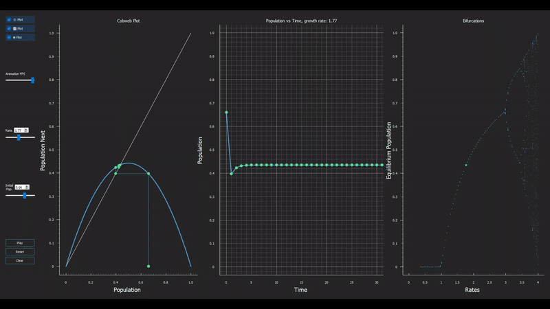

# Descripción
La población de una comunidad se puede modelar con la fórmula:

$P_{n+1} = f \times P_n \times (1 - P_n)$ :tag:

Donde:
* $P_n \in [0, 1]$ representa el procentaje de la población existente en el año $n$ con respecto al máximo,
* $f \in [0, 4]$ es la constante de **fertilidad** y representa la tasa de crecimiento de la población.

### Comportamiento
Como se verá a continuación, la población presenta un comportamiento diferente dependiendo de la constante de fertilidad $f$. 

* Cuando $0 \le f \le 1$ la población eventualmente muere independiente del valor de población inicial $P_0$.
    - En este caso se dice que tiene 0 bifurcación. 
* Cuando $1 < f < 2$ la población se estabiliza independiente del valor de población inicial $P_0$.
    - En este caso se dice que tiene 1 bifurcación. 
* Para ciertos valores de $f$, la población oscila entre dos valores.
    - En este caso se dice que tiene 2 bifurcaciones.
* Para los valores restantes de $f$, debe determinar el comportamiento de la población y el número de bifurcaciones.

## Ejemplos
### Caso 1
Dado $f = 2, P_0 = 0.75$

$P_1=2 \times 0.75 \times (1 - 0.75) = 0.375$

$P_2=2 \times 0.375 \times (1 - 0.375) = 0.46875$

$P_3=2 \times 0.46875 \times (1 - 0.46875) = 255/512 \approx 0.49805$

$P_4=2 \times 255/512 \times (1 - 255/512) \approx 0.4999...$

$P_5=2 \times 0.4999... \times (1 - 0.4999...) = 0.4999...$

$P_6=2 \times 0.4999... \times (1 - 0.4999...) = 0.4999...$

En este ejemplo, la población converge al valor de $0.5$ (1 bifurcación), esto se puede ver gráficamente en la siguiente Figura:

### Caso 2
Dado $f = 3.2, P_0 = 0.4$

| $P_n$ |Valor  |
|-------|-------|
| P0    |0.4000 |
| P1    |0.7680 |
| P2    |0.5702 |
| P3    |0.7842 |
| P4    |0.5415 |
| P5    |0.7945 |
| P6    |0.5225 |
| P7    |0.7984 |
| P8    |0.5151 |
| P9    |0.7993 |
| P10   |0.5134 |
| P11   |0.7994 |
| P12   |0.5131 |
| P13   |0.7995 |
| P14   |0.5131 |

En este caso, vemos que la población no converge a ningún valor, sino que oscila entre $0.7995$ y $0.5130$ (2 bifurcaciones), esto se puede ver gráficamente en la siguiente Figura:

## Objetivos
* Investigue sobre puntos fijos e iteración funcional.
* Determine la expresión matemática del valor al cual converge la población cuando $1 \le f \le 2$.
* Determine el número de bifurcaciones para todos los valores de  $f \ge 0$.
* Determine el comportamiento de la población para los valores restantes de $f$ y $P_0$.

* Implemente en Python un programa que modele el comportamiento de la población. Su programa debe:
    + incluir controles de sliders para $f$ y $P_0$,
    + graficar la evolución de la población en función del tiempo,
    + graficar la tasa de bifurcación en función de $f$.

