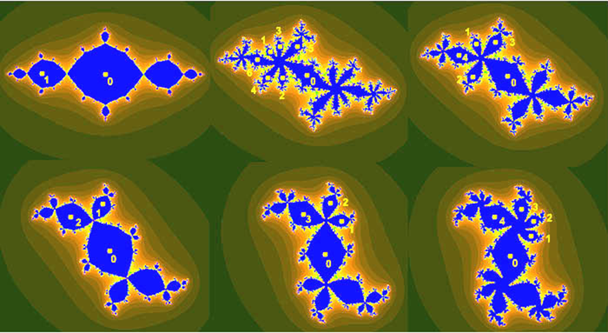

# Fractales en el plano complejo
En este proyecto se debe generar los puntos de un fractal similar a los de la siguiente figura. 

# Descripción
El conjunto $F_s \in \mathbb{C}$ está conformado por los puntos $c\in \mathbb{C}$ para los cuales la [ecuación (1)](#1)  no diverge. 
$$
z_{(n+1)}=z_n^2+c \tag{1}
$$
usando la condición inicial $z_0=0$. 
Itere hasta que:
$$
|z_n |≥2 \tag{2}
$$

Asigne un color a cada punto $c$ del plano complejo dependiendo del número de iteraciones requeridas para cumplir con la condición dada. 

# Ejemplo
# Objetivos del Proyecto:
+ Calcular los puntos de un fractal
+ Dominar técnicas de los métodos numéricos para asegurar una alta exactitud
+ Visualizar el fractal resultante.

# Requerimientos
+ Se debe poder hacer zoom interactivamente, y la figura debe redibujarse. 

## Consejos para la implementación
+ Cree una cuadrícula de puntos complejos en el plano.
+ Para cada punto $c$, itere la secuencia $z_n$ hasta que alcance un límite o diverja.
+ Cuente el número de iteraciones antes de la divergencia y asigne un color según este valor.
+ Cada píxel en la imagen corresponderá a un punto en la cuadrícula.
+ Asigne diferentes colores según el número de iteraciones (se recomienda usar la función $ln$).
# Experimentación
+ Ajuste los parámetros (resolución, límites, colores) para explorar diferentes regiones del fractal. 
+	Muestre el resultado en los rangos:
	
	1. $-2.25<x<1.25, -1.5<y<1.5 $

	1. $-1.943,<x<-1.94, -0.0012<y<0.0012 $

	1. $-1.764<x< -1.7527, -0.01925<y<-0.0109 $

	1. $-1.768562608<x<-1.7685626045, -0.000790008<y<-0.000790005 $

+ Realice una animación y hacer zoom en cada rango dado.

## Preguntas de análisis
	* ¿Cómo afecta la resolución de la cuadrícula al resultado visual?
	* ¿Cuál es la resolución máxima de su programa?

<video controls  loop autoplay src="video_fractal.mp4" title="Title"></video>