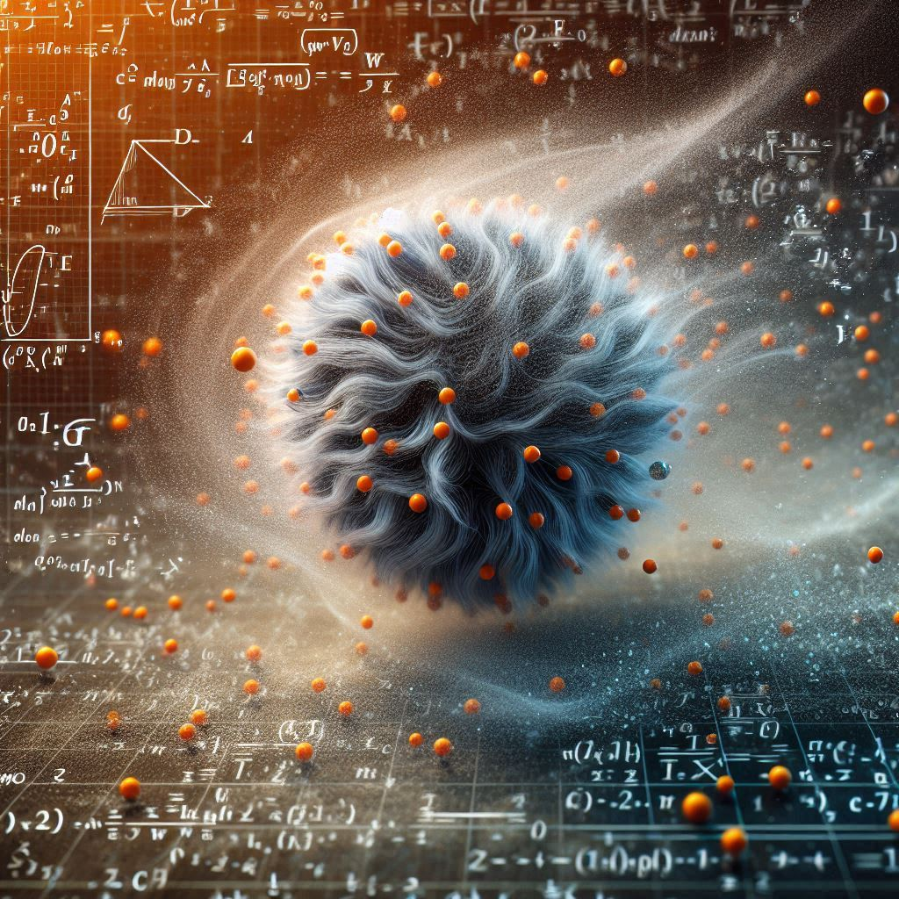
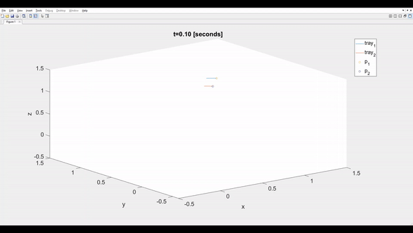

# Descripción
<!-- {width=5%} -->

Un nanodron de masa despreciable que se desea utilizar en meteorología sigue las siguientes ecuaciones de movimiento:

$\frac {\delta x} {\delta t} = \alpha (y - x)$

$\frac {\delta y} {\delta t} = x(\beta - z)- y$

$\frac {\delta z} {\delta t} = x y - \gamma z$

Donde:
* $x$, $y$ y $z$ son las coordenadas del nanodron en el espacio.
* $\alpha$, $\beta$ y $\gamma$ son constantes positivas.
* $t$ es el tiempo.

# Caso 1
Cuando $\alpha = 0.1$, $\beta = 0.1$ y $\gamma = 0.1$.
* posición **A** inicial del nanodron es $x = 1$, $y = 1$ y $z = 1$.
* tiempo de simulación 10 segundos.
* posición **B** inicial del nanodron es $x =0.9$, $y =0.9$ y $z = 0.9$.

# Caso 2
Cuando $\alpha = 10$, $\beta = 28$ y $\gamma = 8/3$.

# Objetivo
* Implementar un programa que permita graficar la trayectoria del nanodron en el espacio.
* El programa debe permitir ingresar los valores de $\alpha$, $\beta$ y $\gamma$ y graficar de manera interactiva la trayectoria del nanodron.
* El programa debe permitir ingresar el tiempo de simulación.
* Grafique la trayectoria del nanodron para diferentes valores de $\alpha$, $\beta$ y $\gamma$.
* Realice experimentos para al menos 3 casos de prueba diferentes de $\alpha$, $\beta$ y $\gamma$.
* Realice experimentos para al menos 3 posiciones iniciales diferentes del nanodron, siendos estás muy cercanas entre sí.
* Realice un video de máximo 30 segundos del uso de su programa.

